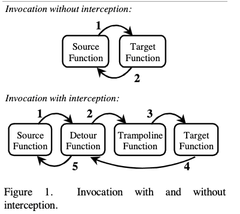
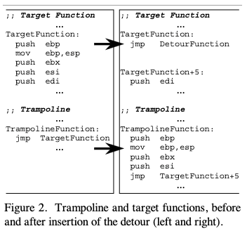

# API Hooking
It a generic way used by malware developers to intercept calls in Windows APIs in order to change the input or output of certain functions. A key motivation for creating API hooking was to add advanced functionalities to a given module  by injecting user supplied code. The debuggers use the hooking technique to intercept API calls.

There are three types of API Hooking:

## Hooking with Detours

The method was invented by researchers at Microsoft. The following figure from the research paper published [here](https://www.cs.columbia.edu/~junfeng/10fa-e6998/papers/detours.pdf).

The following figure describes the logical flow of control for function invocation with and without interception.



The first depiction is straight-forward as there is no interception, the source function would directly invoke the target function. In the second part, the detours operation is described.

Detours replaces the first few instructions of the target function with an unconditional jump to the user-provided detour function. Instructions from the target function are preserved in a trampoline function. The trampoline consists of the instructions removed from the target function and an unconditional branch to the remainder of the target function. When execution reaches the target function, control jumps directly to the user-supplied detour function. 



In this image, on the left hand side, the target function has some instruction, and we want to hook. At this stage, the trampoline function is empty. So when we set the hook we need to copy some instructions to the trampoline function. These instructions themselves are overwritten with a `JMP` instruction to the Detour function. Once the trampoline function executes, the `JMP` instruction is used as an offset in the target function.

### A Sample Program

Here is a simple program which hooks on to the message box function in a program. The program is quite simple, it displays messagebox on the screen.

```cpp
#include <windows.h>
#include <stdio.h>
#include <stdlib.h>
#pragma comment(lib, "user32.lib")

int main(void){
	MessageBox(NULL, "First", "HOOKS", MB_OK);
	getchar();
	MessageBox(NULL, "Second", "HOOKS", MB_OK);
	getchar();
  return 0;
}
```
Compile this program and execute.

Below the headers and functions are declared in the source code:

```cpp
#include <stdio.h>
#include <windows.h>
#include "detours.h"
#pragma comment(lib, "user32.lib")

// pointer to original MessageBox 
int (WINAPI * pOrigMessageBox)(HWND hWnd, LPCTSTR lpText, LPCTSTR lpCaption, UINT uType) = MessageBox;
	BOOL Hookem(void);
	BOOL UnHookem(void);
```

The DLL main function decribed the operations performed where process is attached ( hooked ) and detached ( unhooked).

```cpp
BOOL WINAPI DllMain(HINSTANCE hinst, DWORD dwReason, LPVOID reserved) {

    switch (dwReason)  {
		case DLL_PROCESS_ATTACH:
			Hookem();
			break;
			
		case DLL_THREAD_ATTACH:
			break;
			
		case DLL_THREAD_DETACH:
			break;
			
		case DLL_PROCESS_DETACH:
			UnHookem();
			break;
	}
    return TRUE;
}
```

The following is the hooking function which would take over the execution from the original function. It doesnt do much other than display a message on the console.

```cpp
int HookedMessageBox(HWND hWnd, LPCTSTR lpText, LPCTSTR lpCaption, UINT uType) {
	printf("HookedMessageBox() called. No popup on screen!\n");
	return IDOK;
}
```

The function below is the function which is performs the hooking. The comments inline explains the operation it performs.

```cpp
// Set hooks on MessageBox
BOOL Hookem(void) {
  LONG err;
	// Hooking is done with transactions, and to start the transaction, the following function is called.
	DetourTransactionBegin();
	// The following function enlist all the threads that the hook would use. So any threads returned by GetCurrentThread(), would have a consistent code.
	DetourUpdateThread(GetCurrentThread());
	// Setting hook, where first parameter, the address of the function we want to hook is passed. The second parameter is the address of the function which would take over the execution of the hooked function (HookedMessageBox).
	DetourAttach(&(PVOID&)pOrigMessageBox, HookedMessageBox);
	// The transaction is committed with the call.
	err = DetourTransactionCommit();	
	return TRUE;
}
```

The function for unhooking is below. The code remains same as before except DetourDetach() function was called instead of DetourAttach().
```cpp
// Revert all changes to original code
BOOL UnHookem(void) {
	

	LONG err;

	DetourTransactionBegin();
	DetourUpdateThread(GetCurrentThread());
	DetourDetach(&(PVOID&)pOrigMessageBox, HookedMessageBox);
	err = DetourTransactionCommit();
	return TRUE;
}
```

## IAT Hooking
Another method of hooking is with Import Address Table (IAT). Code remains the same except the hooking function. 

Below code gets a handle to the main module which is the current executable.
```cpp
BOOL Hookem(char * dll, char * origFunc, PROC hookingFunc) {

    ULONG size;
	DWORD i;
	BOOL found = FALSE;
	HANDLE baseAddress = GetModuleHandle(NULL);			
```

We do not need to parse the PE headers anymore to find the import address table. With the following Win32 function (ImageDirectoryEntryToDataEx), we can reach IAT table directly.
	
```cpp
	PIMAGE_IMPORT_DESCRIPTOR importTbl = (PIMAGE_IMPORT_DESCRIPTOR) ImageDirectoryEntryToDataEx(
												baseAddress,
												TRUE,
												IMAGE_DIRECTORY_ENTRY_IMPORT,
												&size,
												NULL);

```
Find the address of the module looping through the IAT and comparing it with string with function parameter `dll`.

```cpp
	for (i = 0; i < size ; i++){
		char * importName = (char *)((PBYTE) baseAddress + importTbl[i].Name);
		if (_stricmp(importName, dll) == 0) {
				found = TRUE;
				break;
		}
	}
	if (!found)
		return FALSE;
```

Optimization: get original address of function to hook  and use it as a reference when searching through IAT directly.

```cpp

	PROC origFuncAddr = (PROC) GetProcAddress(GetModuleHandle(dll), origFunc);

	// Search IAT
	PIMAGE_THUNK_DATA thunk = (PIMAGE_THUNK_DATA) ((PBYTE) baseAddress + importTbl[i].FirstThunk);
	while (thunk->u1.Function) {
		PROC * currentFuncAddr = (PROC *) &thunk->u1.Function;
		
		// found
		if (*currentFuncAddr == origFuncAddr) {
```

Once the function is found, the address is made writable, address is then replaced with that of the hooking function in parameter `hookingFunc`. The memory is reset to previous permissions.
```cpp
			// make sure memory is writable
			DWORD oldProtect = 0;
			VirtualProtect((LPVOID) currentFuncAddr, 4096, PAGE_READWRITE, &oldProtect);

			// set the hook
			*currentFuncAddr = (PROC)hookingFunc;

			// revert protection setting back
			VirtualProtect((LPVOID) currentFuncAddr, 4096, oldProtect, &oldProtect);

			printf("IAT function %s() hooked!\n", origFunc);
			return TRUE;
		}
	thunk++;
	}
	
	return FALSE;
}
```

The hooking is now complete.

[back](../malware.md)