Export Directory

# Export Directory
Note Lets talk about how the loader find the export funtions exported by the DLLs.  Lets first look at the structure definition of export directory from `winnt.h` header file.

```c
typedef struct _IMAGE_EXPORT_DIRECTORY {
    DWORD   Characteristics;
    DWORD   TimeDateStamp;
    WORD    MajorVersion;
    WORD    MinorVersion;
    DWORD   Name;
    DWORD   Base;
    DWORD   NumberOfFunctions;
    DWORD   NumberOfNames;
    DWORD   AddressOfFunctions;     // RVA from base of image
    DWORD   AddressOfNames;         // RVA from base of image
    DWORD   AddressOfNameOrdinals;  // RVA from base of image
} IMAGE_EXPORT_DIRECTORY, *PIMAGE_EXPORT_DIRECTORY;
```

There are some more important fields than the others. They following are all arrays:
1. AddressOfFunction - RVAs of function ( or pointers ) which are exported in the DLL, and this array is called export address table.
2. AddressOfNames - The names of the functions from the export adderess table
3. AddressOfNameOrdinals. -  This is the array of numbers.

The field  `NumberOfFunctions` lists ther number of exported functions. 
The field `NumberOfNames` lists the number of entried from the array `AddressOfNames` and `AddressOfNameOrdinals`. These sizes of these arrays are similar.

Another field is `Name` holds the RVA to string with the name of the DLL. The `base` contai ns the first ordinal number of the DLL. 

The DLL can export the functions as names and ordinals ( just a number!).

Lets see how the loader find address to an export function.  Lets look at the image below:

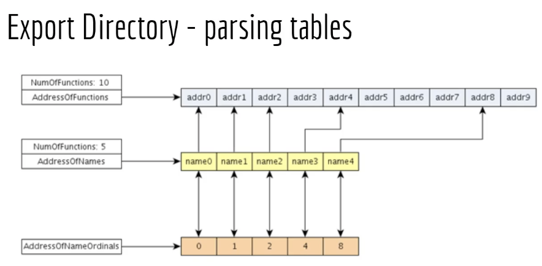

Lets say the loader is looking for a function with name `name3`. The loader first checks the array `AddressOfNames` which is the array that holds the name of the exported functions. The loader finds the name in the array at an particular offset. The loader then checks the array `AddressOfNameOrdinals` which is array that contains some numbers. At the same offset from the `AddressOfNames`, the loader finds the ordinal that corresponds to function `Name3`  which is `4`.

Now, armed with this information, loader would then check the `4` memory location in `AddressOfFunction` to find the RVA of `name3` function.

There are sometimes situations when we do not have function name instead only ordinal number is provided. In which case to find the RVA, we find the `base` of the ordinal, and substract it from the ordinal which we have. For example if `6` is the number then `6-1=5` would be the location where out RVA is located.

Lets take the example of `kernel32.dll` which are hundreds of export functions. Under `Optional Hdr`, and `Export Directory` has the address `90190`.

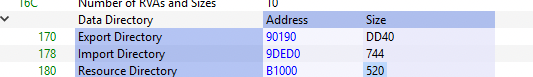

We match the values in the address location with that of fields desribed in the definition:

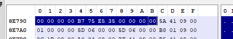

Using the `Go to RVA` component, we check the RVA location `094151`

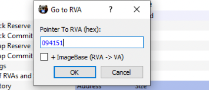

Clicking on OK, the name of the function was observed as `Kernel32.dll`:

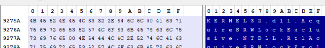

Going further we observed the `base` field constains the value `1` which means number of ordinal starts at 1. The `NumberOfFunctions` holds value `065D` which in decimal 1629 functions. The `NumberOfNames` has the same value `065D`. The last three are arrays which we discussed earlier. To View these values already resolved, we can click on `Exports` tab of PE Bear.

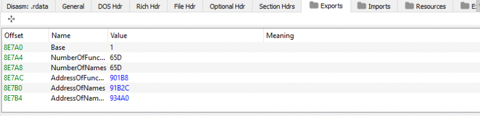

If we click on the `AddressOfFunctions`  value `901BB`, addresss layout would show their values.

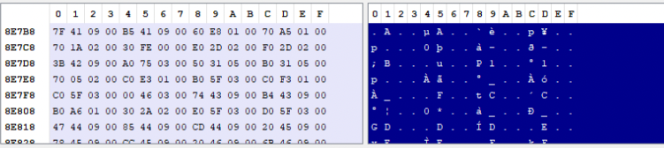
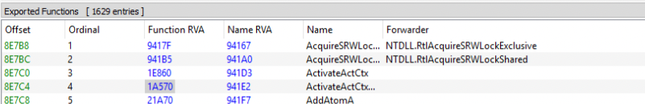

The other two arrays are also resolved in similar fashion.

Another interesting thing to note is related is the function RVA addresses location, for example the high address locations `9417F`  and there are low address locations `1e860`. When one of low address locations are clicked, we are in the `.text` section of the PE.

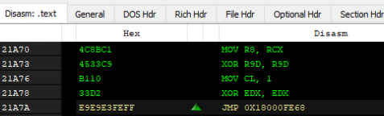
 
But high addresses are in the `.rdata` sections:

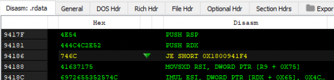

Upon resolveding the address locations pointed by the RVA, we notice another DLL name:

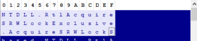

So, when the loader finds another string instead of RVA, this is usually a forwarder which points to another string, in this case `NTDLL.RtlAcquireSRWLockExclusive`. The loader would go to this new DLL, parse that DLL and look for the function `AcquireSRWLockExclusive`. This function address is returned.

But, how does the loader know that offset mentioned is a forwarded function or an RVA ? If the address falls within the range of `Export Directory` range, then its a forwarded function.

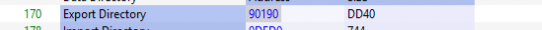

To see same information with dumpbin, we can do that with the command

```
dumpbin /exports C:\Windows\system32\kernel32.dll
```

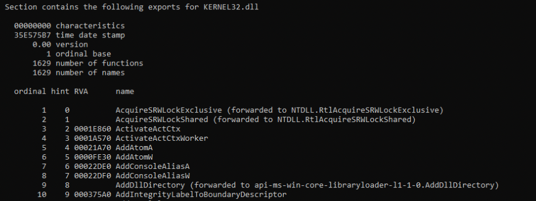