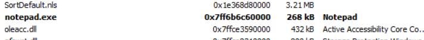
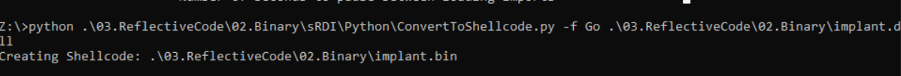

Reflective Loader

# Reflective Loader

The Reflective Loader code injection technique is a method for loading malicious code into a target system's memory without the use of traditional executable files. This technique is commonly used in advanced persistent threats (APTs) and other forms of malware.

Lets see how this works:

Reflective DLL is a specially crafted dynamic library ( lets say 'attack.dll ) with its own PE loader. The loader is exported as a function called reflective loader. The following are the sequence of operation that follows:

1. When this function is loaded, it start with resolving functions it needs at the beginning ( from DLLs for example from `kernel32.dll` and `ntdll.dll` ). 
2. Allocates new memory region in the process.
3. Copy its headers and sections from the attack.dll to the target process.
4. Goes through the import address table of attack.dll and resolves the functions needed by this DLL. Also the other dependent DLLs are loaded.
5. Fix the reallocations in the PE memory.
6. Calls the entry point in the attack DLL.

## Source Code Review
The reflective DLL was written by Stephen Fewer from Harmony Security. You can find the original source code [here](https://github.com/stephenfewer/ReflectiveDLLInjection). The following section summarises my own understanding of Stephen fewers' reflective DLL source code coupled with learnings from Sektor7 course on malware development. As such the souce code is very well documented by Stephen fewer therefore only the important parts are surmised below:

### Find Image Based Address
Starting from line 1 to line 85 several variables are initialised, the interesting line starts at line number 88 which finds the current address in the memory.

```cpp
uiLibraryAddress = caller();
```

The original function caller is defined on line 41:

```cpp
__declspec(noinline) ULONG_PTR caller( VOID ) { return (ULONG_PTR)_ReturnAddress(); }
```

The `__declspec(noinline)` keyword ensures that the function is not inlined, which can be useful for debugging purposes. The `_ReturnAddress` function is a compiler intrinsic function ( which means function that is built into compiler ) that returns the address of the instruction that will be executed after the current function call completes.

Now that `uiLibraryAddress` variable has the current process address in memory, a loop is used to search backwards in memory to find the image base address. This is described in lines 92 to 109. 


Here the the `uiLibraryAddress` memory location is casted to `PIMAGE_DOS_HEADER` structure. 

```cpp
typedef struct _IMAGE_DOS_HEADER {      // DOS .EXE header
    WORD   e_magic;                     // Magic number
    WORD   e_cblp;                      // Bytes on last page of file
    WORD   e_cp;                        // Pages in file
    WORD   e_crlc;                      // Relocations
[snipped..]
	 	LONG   e_lfanew;                    // File address of new exe header
  } IMAGE_DOS_HEADER, *PIMAGE_DOS_HEADER;
```

This is a 64-byte-long structure and it has two important members.

1. **e_magic** - This is the first member of the DOS header, a WORD which occupies two bytes which stores a magic number. This is a fixed value `0x5A4D` or `MZ` in ASCII. This is the signature ( the values being compared to `IMAGE_DOS_SIGNATURE` ). Therefore if this value is found, then we have the memory address pointing to the start of the current image base address.
2. **e_lfanew**- This is the last member of the DOS header structure, located at the offset `0x3C` and holds an offset to start of NT headers. In the source code on line 96, the variable `uiHeaderValue` contains this offset value. This is an important header to the PE loader because it tells where to look for file headers. Once we have this offset, its added to `uiLibraryAddress` to point to NT header address location. The NT header structure too has a signature which is then verified on line 103.

### Process Kernel Exports

We start by finding the process execution block depending on the process ( x32 or x64). 


Once we have the correct offset to the PEB, get to the list of process loaded modules. Line number 127, the parameter `uiValueA` contains the address to the first address of the module list (Note that first module is always the PE itself ).


The parameter `uiValueB` stores the name of the DLL and `usCounter` stores the length of the name. Lines from 138 to 147 is ROR hash calculation which is then compared with `KERNEL32DLL_HASH`. This is declared in "ReflectiveLoader.h" file.


The hash is calculated for all the modules and compared to find kernel32.dll module.


The next interesting lines are on lines 162,165 and 168 which calculates the address of export directory, name pointers and finally the ordinals array.

In the next few lines, we find address of three functions in kernel32.dll - LoadLibraryA, GetProcAddress and VirtualAlloc. To do so, the loop through the name array, calculate the hash of each of the function and then compare against hashes of the three functions mentioned earlier. If there is match, their address is calculates and store in variables as `pLoadLibraryA`, `pGetProcAddress` and `pVirtualAlloc`. The outer loop ends when the counter decrements from 3 to 1.

Line 206 to 266, is similar to calculating kernel32.dll base address and the three functions. In these lines, ntdll.dll is found and the address of a single function `pNtFlushInstructionCache` is calculated.


### Load Image to a permanent location in memory

Using the `pVirtualAlloc` we allocate a region of memory and also make it READ, WRITE and EXECUTABLE. The new location address is stored in `uiBaseAddress`. The next three lines performs the copying operation where the headers are copied into our new memory location.


### Loading all sections
Here we load all the sections. On line 284, we add the base address of optional header and size of the optional header ( stored in the Fileheader). This will lead to starting location of the first section stored in `uiValueA`. The parameter `uiValueE` would have count of number of sections.


Similar to the previous, the section data is copied to the location in the memory, and process is repeated for all the sections.

### Process our images Import Table

Once the sections are loaded, now we need to process the import address table. We begin by finding the address of import directory in `uiValueB`. The parameter `uiValueC` stored the address of the first entry in IAT.


Line 319 enters into a while loop which iterates through the names in the table. In the next few lines, the library is loaded into the memory with `pLoadLibraryA` function we found earlier. The values `uiValueD` and `uiValueA` stores the virtual address of `OriginalFirstThunk` and `FirstThunk`.

The following part of the code find the address with the ordinal number, if the no name is present. The addres is stored in `uiValueA`.


And if name is present, using the `pGetProcAddress` function is called to calculate the address from the name and stored in `uiValueA` on line 360.

This process is reported for all function in the import table.

### Process Image Relocations

Binaries can be loaded at any address in a memory although they contain some preferable image base compiled into the PE headers. It still means that some parts of the binary might refer to the original image base via absolute addressing which means that the application may crash at some point due to the hardcoded adresses. To address this problem, we have *reallocation* which is like a table which stores these absolute addresses.  

Lets inspect a binary with PE Bear to the reallocation tables in action. Firstly in the Optional header, under DLL Characterists, mentions "DLL can move". This means that the loader does not need to comply with th "Base Address" value mentioned "14000000" and load anywhere.


Lets take a look at the reallocation table, upon clicking on the `BaseReloc.` tab, we see the following:


There are three entries, each offset is a map to a memory with the following structure:

```cpp
typedef struct _IMAGE_BASE_RELOCATION
{
	DWORD	VirtualAddress;
	DWORD	SizeOfBlock;
	/* WORD	TypeOffset[1]; */
} IMAGE_BASE_RELOCATION,*PIMAGE_BASE_RELOCATION;
```

The first 4 bytes represent the 1C000 followed by 4 bytes block size ( also contains size of entire structure ) i.e 8 bytes for this structure followed by 170 bytes ( remaining size of structure ). Lastly the two bytes are the types of the field, in our case the value is 10, which is a 64Bit field. 


Lets take practical example to calculate the reallocation address manually.

1. We have the base address of the notepad.exe in memory:

2. Note lets calculate the delta value, ie actual base address (0x7ff6b6c60000) - virtual address ( 140000000 ) = 0x7FF576C60000
3. Now lets add the VirtualAddress from first block of reallocation table (Reloc RVA).

0x7FF576C60000 + 140024AD0 = 7FF6B6C84AD0

This is how reallocation address is calculated.

With this understanding, the code becomes easy to understand. Line 375 is where the delta is calculated and `uiValueB` contains the address of relocation directory.


In the remaining part of the code, the relocation block offset size of the block and then the  entries in each of these blocks. The number of entries is stored in `uiValueB`. From Lines 399, the while loop iterates over each entry and copy the values to `uiValueA`. Note that `IMAGE_REL_BASED_HIGHLOW` is for 32bit process. In the example of notepad, we saw `IMAGE_REL_BASED_DIR64` whichw as 64bit process.

### Calling the Entry Point

Line 458, the VA of entry point is stored in `uiValueA`.  On line 461, `pNtFlushInstructionCache` is called to empty the CPU cache to remove any stale code. Finally on lines 466 or 469 depending on our injection, one of them is called to invoke our entry point.


 ## Shellcode RDI - Shellcode Reflective DLL Injection
This method is useful when we do not have source code to the application. Then with the help of this project, we could convert the target DLL into shellcode and reflectively inject in the memory. The sRDI project loads the DLL, call its entry point and pass the user data to another exported function.
 
 1. Its takes the larger DLL which needs to be loaded into the memory.
 2. Loads the reflective loader on top of it.
 3. Then loads a bootstrap over the reflective loader. The bootstrap is a shellcode which prepares the memory before passing the execution to RDI.
	 1. Bootstrap find the current location in memory.
	 2. Calculates and setup registers.
	 3. Find the execution to RDO, with function hash, user data and location of the target DLL.
 4. RDI Unpack the DLL and remap the sections.
 5. RDI calls DLL Main.
 6. Call exported function via Hash name (RDI) (optional)
 7. Pass user data to exported function ( optional)

Next section demonstrates the working of this tool. Note that following example is part of Sektor7 institute's malware development course.

This program is part of a larger DLL source code, the following is an **exported** function called `Go` which injects a payload into the memory.

```cpp
extern "C" __declspec(dllexport) void Go(void) {

    void * exec_mem;
    BOOL rv;
    HANDLE th;
    DWORD oldprotect = 0;
		unsigned int payload_len = sizeof(payload);
		exec_mem = VirtualAlloc(0, payload_len, MEM_COMMIT | MEM_RESERVE, PAGE_READWRITE);
		RtlMoveMemory(exec_mem, payload, payload_len);
		rv = VirtualProtect(exec_mem, payload_len, PAGE_EXECUTE_READ, &oldprotect);

	if ( rv != 0 ) {
					th = CreateThread(0, 0, (LPTHREAD_START_ROUTINE) exec_mem, 0, 0, 0);
					WaitForSingleObject(th, -1);
	}

}
```

The following are the options ( the python script ):


Apart from loading reflectively, the tool also has options to clear headers and also obfuscate-imports.
 
Lets use this tool to covert the above DLL to shellcode.



This shellcode can then be injected into a process or thread.
