# Import Address Table
When the PE loader starts to load the module into memory, it will parse the import address table. When it parses the data directory, at some point it will load the import directory. The import directory would contain the pointer to memory region, that holds image_import_descriptor. The definition is below:

```c
typedef struct _IMAGE_IMPORT_DESCRIPTOR {
	union {
		DWORD   Characteristics;           
		DWORD   OriginalFirstThunk;         
	} DUMMYUNIONNAME;
	DWORD   TimeDateStamp;                  
	DWORD   ForwarderChain;                 
	DWORD   Name;
	DWORD   FirstThunk;                     
} IMAGE_IMPORT_DESCRIPTOR;

typedef IMAGE_IMPORT_DESCRIPTOR UNALIGNED *PIMAGE_IMPORT_DESCRIPTOR;
```

The `originalFirstThunk`  is a pointer to an `Import Lookup table`. The next field is `FirstThunk` is address of `import address table`. The third field is `Name`  holds the name of the imported DLL.

Note that earlier `originalFirstThunk` was called as `characteristics`, but not any more.

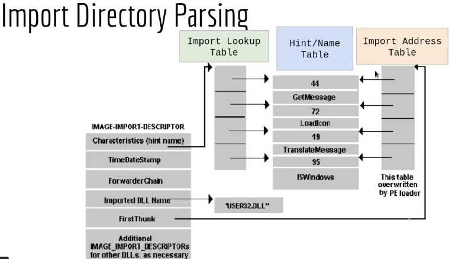

The PE loader locates the record of `image-import-descriptor` in the memory, and then finds the `Name` (Import DLL Name) of the library ( "User32.dll") and loads it into the process memory. The PE loader than starts the parsing process to look for the functions, it would first check the `OriginalFirstThunk` (or `characteristics` in the image ), which holds to pointer to `Image Lookup Table` and first it reads the `hint` ( which is the number part ), this number is used for lookup in the export address table. If the `hint` is already part of export address table, the RVA is extracted from there. This data is written to `Import Address Table`. If loader fails to find the `hint` in the export address table, then it would take the string, and search the export address table for this string, and write the RVA value to import address table. This process would be repeated until the import address table is populated.

But, why import address table is used ? 

Here we take an example of external function `EtwEventWriteTransfer` :

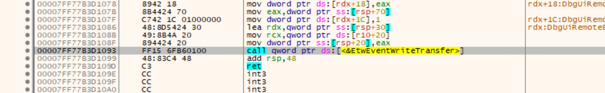

During the compilation time, the compiler tries to resolve all the functions calls but when it encounters an external DLL and external functions, compiler cannot know what would be the future address in the memory of the process. To solve this problem, compiler uses a dedicated memory region prepared during the compilation which woud have pre-populated these external functions. This is called as Import address table.

Lets inspect `notepad.exe` with PE Bear and check out `Data Directory` which holds the pointed to the `Import Directory`.

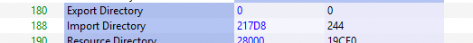

Double clicking on the address value, the address layout changes up top. The following was displayed:

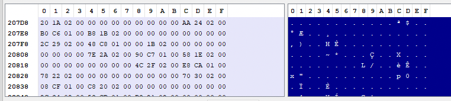

So based on the descriptor we can parse as values as the following:
```
OriginalFirstThunk ( pointing to import lookup table) = 21A20
TimeDatestamp = 0
ForwarderChain = 0
Name = 224AA (advapi32.dll)
FirstThunk( pointing to import lookup table) = 01C6B0
```

The `name` field was resolved to the following data:

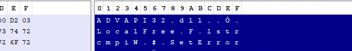

This record is 20 bytes long and as per the size mentioned in `0x244` => `580` which means   `580/20 = 29` external libraries imported. But in reality only 28 libraries are imported, the last record is always empty.

PE Bear has already populated these fields for us in `Imports` tab.

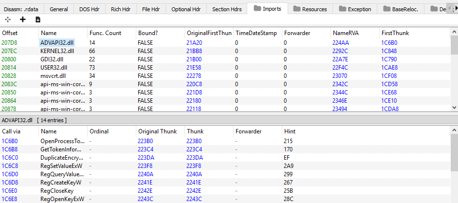

When we analyse the Imports section,  the values that was calculated above is exactly the same as those populated by PE Bear, e.g `207D8` is the base address location of the record of `advapi32.dll` , the `OriginalFirstThunk` points to `Import Lookup Table` and `FirstThunk` points to `Import Address Table`. Note that `Import Address Table` is empty to begin with and is later populated based on the entries from `Import Lookup Table`.

Looking closely at the `Import Lookup Table` we notice that, e.g `OriginalFirstThunk` value of `advapi32.dll`, had the value `21A20`. This is the first address in the `import lookup table`.

The `Import lookup table` looks like the following:

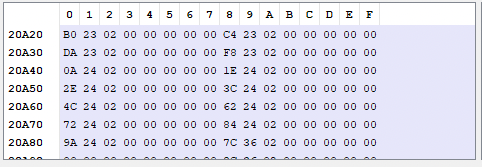

We follow the first entry `223B0`:

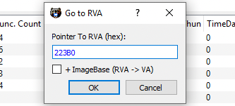

This leads us to `Hint/HintName Table`

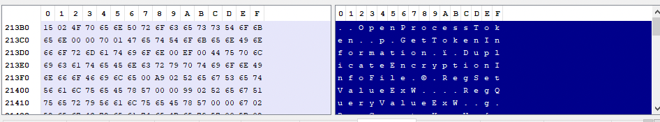

After resolving the `Hint` is 215 and `HintName` is `OpenProcessToken`.

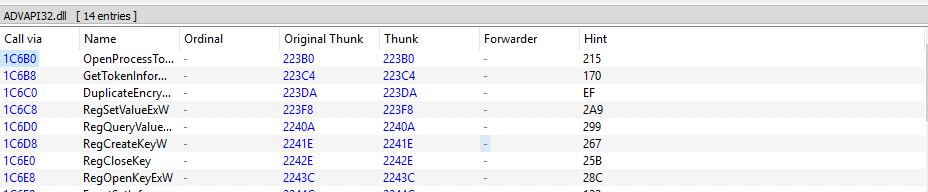

The `Original Thunk` resolved to `Import Lookup Table`, and `Call Via` is the `Import address Table`. The `Thunk` column contains the values from the `Import Address Table` that as demonstrated earlier, points to `Hint` and `Name`.

This concludes the parsing process of `Import Address Table`.

Finally, let see this process in action usinga debugger. We open xdgb64.exe and click on the  `preferences`  button under `Options`. Check `DLL Load` to ensure that breakpoint is hit whenever a DLL is loaded.

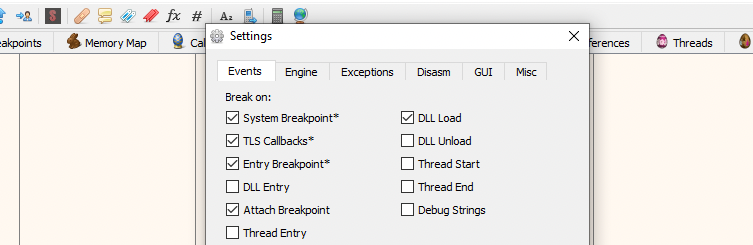

Load the `notepad.exe` into the debugger, click on memory map and locate `.text` section of `notepad.exe`.

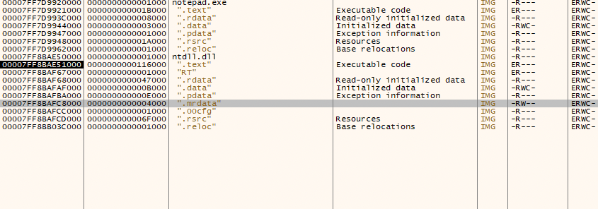

As shown above no other DLL were loaded. Click on `.text` section of `notepad.exe`. and then locate any external function for demonsration purposes. 

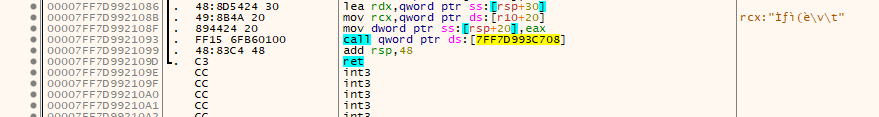

```
00007FF7D9921093|FF15 6FB60100| call qword ptr ds:[7FF7D993C708]
```

Follow the location `7FF7D993C708` in dump. This is the location in the `Import Address Table` and in the beginning would be empty.

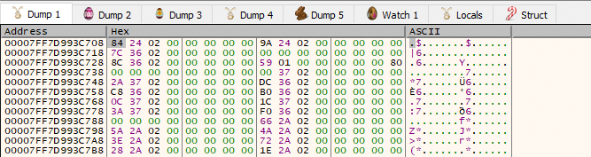

Necxt click `Run` (28 times)  to load all the libraries until debugger hits system breakpoint, this would load all library addresses into the lookup tables. 

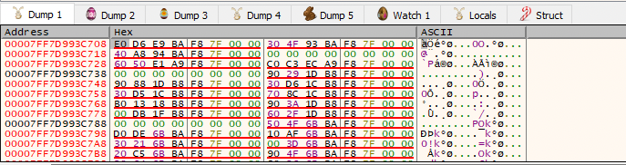

At this point the import lookup table is populated in the process memory.


