Malware

# PE Formats

Lets understand two important concepts related to a PE:

* File pointer - location of an item within a file itself, before being processed by the linker ( in the case of object files ) or the loader ( in the case of image files). In other words, this is a position within a file as stored on disk.
* RVA ( relative virtual address ) - In an image file, this is the address of an item after it is loaded into memory, with the base address of the image file subtracted from it. The RVA of an item almost always differs from its position within the file on disk ( file pointer ). Here we are dealing with addresses in memory.

So in summary, RVA is an offset from the base address to the location we are interested in, and the file pointer is an offset in a file on disk.

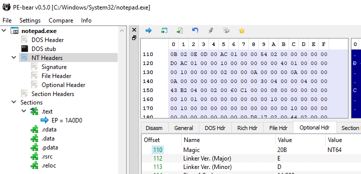

So far we have understood there are two main parts to any PE file, which are *header* and *sections*.

- The *header* contains technical details about the PE or the executable.
- The *sections* are similar to chapters of a book. They contain the content of the executable. 

Next, lets take a deeper look at the header part of a PE, as this may seem overwhelming at first. To easily understand, let us take the analogy of driving a car down the road. So to reach from point A to point B we check the signs on the road and simply follow the signs to get there. 

So, header part would have signs ( pointers ) to the following locations:

- DOS Header
- PE Header
- Optional header
- Data Directories
- sections table

So *PE header* are like road signs, so when you are in *DOS header*, and you want to find location of the PE header, then *DOS header* would have this information. Similarly, when you are at the *PE header* and want to get the information on the Optional header ( e.g size of the *optional header*) , the PE header would have that, and so on.

When you are at the *optional header*, you have a lot more information. You can ask for the type of executable - console, GUI, app, etc. Also entry point within the PE file.

The *data directories* contain information about the type of the PE, about its structure, and its imports and exports - which library does the PE need, etc.

The *sections table* is like table of content in a book, for example chapter one contains the `code` section, chapter two is `text` section, and so on.

Lets analyse the PE headers from `notepad.exe` using PE-Bear. To understand the various headers, we can use a header file called 
`winnt.h` located at `C:\Program Files (x86)\Windows Kits\10\lib\10.0.18362.0\um`.

When we open the `notepad.exe` executable in PE-Bear, on the left the headers are listed:

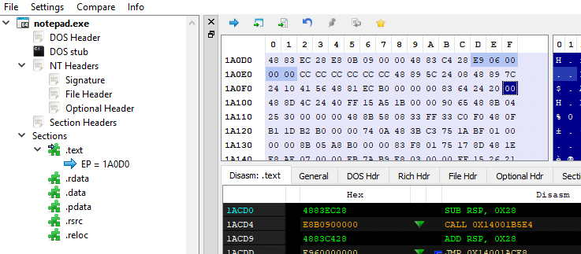

We can walk through the headers to understand how they are organised internally, together with the help of `winnt.h` header file which includes the definitions of these headers. We start with `DOS header` where the column towards the right displays the memory layout.

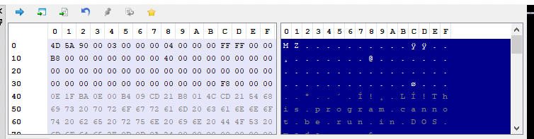

The `winnt.h` header file contains the structure definition of the `DOS Header`:

```c
typedef struct _IMAGE_DOS_HEADER {      // DOS .EXE header
    WORD   e_magic;                     // Magic number
    WORD   e_cblp;                      // Bytes on last page of file
    WORD   e_cp;                        // Pages in file
    WORD   e_crlc;                      // Relocations
    WORD   e_cparhdr;                   // Size of header in paragraphs
    WORD   e_minalloc;                  // Minimum extra paragraphs needed
    WORD   e_maxalloc;                  // Maximum extra paragraphs needed
    WORD   e_ss;                        // Initial (relative) SS value
    WORD   e_sp;                        // Initial SP value
    WORD   e_csum;                      // Checksum
    WORD   e_ip;                        // Initial IP value
    WORD   e_cs;                        // Initial (relative) CS value
    WORD   e_lfarlc;                    // File address of relocation table
    WORD   e_ovno;                      // Overlay number
    WORD   e_res[4];                    // Reserved words
    WORD   e_oemid;                     // OEM identifier (for e_oeminfo)
    WORD   e_oeminfo;                   // OEM information; e_oemid specific
    WORD   e_res2[10];                  // Reserved words
    LONG   e_lfanew;                    // File address of new exe header
  } IMAGE_DOS_HEADER, *PIMAGE_DOS_HEADER;
```

Clicking on `DOR Hdr`  tab on the panel automatically lists the values from this memory sections. For example, the parameter `e_magic`  is `WORD` which occuplies 2 bytes in the memory displayed as 

**4D 5A** 90 00 03 00 00 00 04 00 00 00 FF FF 00 00

Therefore as displayed in the tab, the value is `5A4D`. Similarly, the parameter `e_cblp` is also a word so the corresponding next two bytes:

4D 5A **90 00** 03 00 00 00 04 00 00 00 FF FF 00 00

And so on..

The last parameter `e_lfanew` is interesting, especially because of the analogy of the road signs that was mentioned earlier. The parameter contains the file address of next  header i.e `NT Headers`.

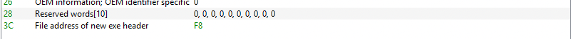. 

The value mentioned in `F8`. Lets click on the F8 value in `DOS Header` tab. The memory layout points now to the file address of `NT Header`. 

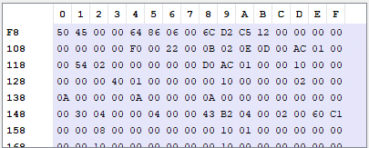

Lets look at the header definition of `NT Header`:

```c
typedef struct _IMAGE_NT_HEADERS64 {
    DWORD Signature;
    IMAGE_FILE_HEADER FileHeader;
    IMAGE_OPTIONAL_HEADER64 OptionalHeader;
} IMAGE_NT_HEADERS64, *PIMAGE_NT_HEADERS64;
```

So, the above definition indicates that 1st 4 bytes is the `Signature` displayed as

**50 45 00 00** 64 86 06 00 6C D2 C5 12 00 00 00 00

The remaining bytes points to the structure of `IMAGE_FILE_HEADER`.

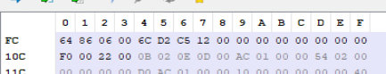

The structure definition is:

```c
typedef struct _IMAGE_FILE_HEADER {
    WORD    Machine;
    WORD    NumberOfSections;
    DWORD   TimeDateStamp;
    DWORD   PointerToSymbolTable;
    DWORD   NumberOfSymbols;
    WORD    SizeOfOptionalHeader;
    WORD    Characteristics;
} IMAGE_FILE_HEADER, *PIMAGE_FILE_HEADER;
```

The most interesting part is the last parameter `Characteristics` which tells us characteristic of the binary. In this case the values are `2` and `20` which based on `winnt.h` header file, suggests that PE is executable has an address space that is larger than 2GB.

```c
#define IMAGE_FILE_EXECUTABLE_IMAGE          0x0002  // File is executable  (i.e. no unresolved external references).
[...]
#define IMAGE_FILE_LARGE_ADDRESS_AWARE       0x0020  // App can handle >2gb addresses
```
Again the `File Hdr` tab in PE Bear automically fetches this data for us:

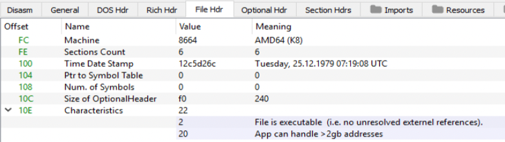

Note that the offset `10C` in PE memory ( also the `SizeOfOptionalHeader` parameter ) shows the size of the `Optional Header` as `240` bytes

The next header within `NT Header` is  the`Optional Hdr`. The `Optional Hdr` has lot more fields therefore we shall discuss the most important ones. 

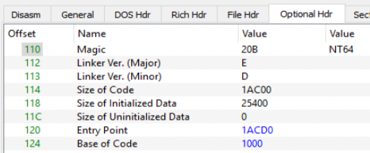

The `Entry Point` value `1ACD0` is an RVA ( points to an offset in memory ) to the `.text` section of the PE i.e the first instruction which is executed after the process is loaded. Clicking on this binary, the `Diasm` tab points to the `.text` section.

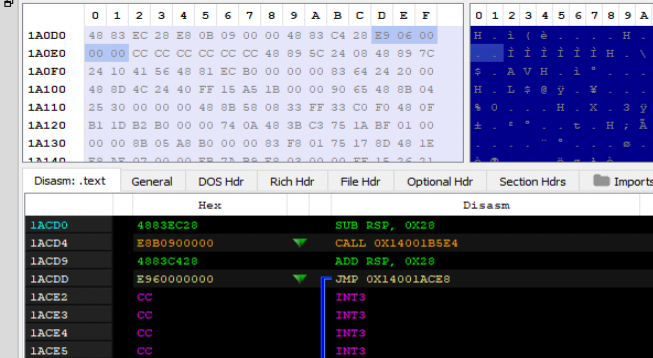

The `Image Base` with value `140000000`  ( aka base address ) is the address of the virtual memory from where the PE would be loaded. The next is `Subsystem` has the value `2` which  ( from on the definition from the header file ) indicates that the PE is a GUI, which is true as `notepad.exe` is a GUI application.

```c
// Subsystem Values

#define IMAGE_SUBSYSTEM_WINDOWS_GUI   2   // Image runs in the Windows GUI subsystem.
```

The next one is `DLL Characteristics`, although its called DLL, the same applies to EXE as well. BE Bear has already resolves this as shown.

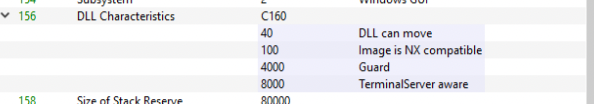

Based on the definition from the header file we know the following:

|40|DLL Can Move| Dynamic base which means the base address can change while loading, and therefore can be changed.|
|100|Image is NX compatible|The stack in the process is non-executable, also called as DEP.|
|4000|Guard| This refers to control flow guard, this image supports CFG.|
|8000|TerminalServer Aware| Indicates the image is terminal service aware.|

We can also view this information once we load the PE in the memory. So, open `notepad.exe` and start `Process Hacker`. Open `notepad.exe` properties and go `General` tab under `Mitigation Policies`  displays the details gathered from PE Bear. 

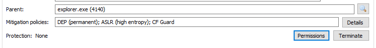

Also, while we are in `Process Hacker` lets also checkout the base address of the application in memory

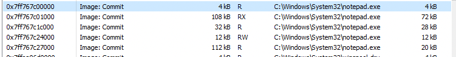

The base address `0x7ff767c00000` is different from the one mentioned in the PE Bear `140000000` which is expected former is from memory and the latter is on the disk.

The next field "Number of RVAs and Sizes" holds the information of how many members of data directory are in place and by default it is `16` or `0x10`. The subsequent section holds the data directory, which contains data which points to more related data. For example, `Export Directory` holds the address which points all the DLL and functions it exports. Similarly, `Import Directory` holds the address which points to the location that lists all the imported functions and so on.

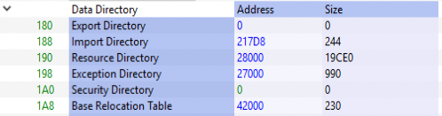

The corresponding definition in the header file is below:

```c
typedef struct _IMAGE_DATA_DIRECTORY {
    DWORD   VirtualAddress;
    DWORD   Size;
} IMAGE_DATA_DIRECTORY, *PIMAGE_DATA_DIRECTORY;
```

So at offset 180, two 4 bytes, each with value `0` which there are no export addresss table.

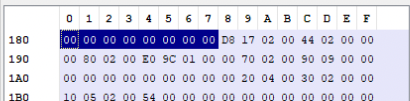

However, the next 4 bytes is the address of `Import Directory` which has the value `217D8`. This process goes on. Another important point to mention is that the `Data Directory` ends with two empty records.

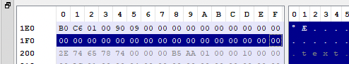

The last entry to discuss is the `Import Address Table` located at `1E0` offset holds the value `1C6B0`. Lets take a look with xdbg tool and reach this memory location in process memory. Start `notepad.exe` and attaching debugger to it. Under memory map, the base address is noted:

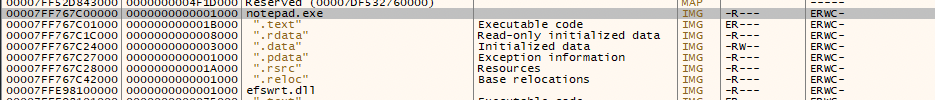

Double clicking on this based address (`00007FF767C00000`) in memory map will display the address location is `Dump`. You can see the start location display the values `4D 5A` which is the signature of  `DOS Header`. 

To find the offset of `Import address table`, we enter `CTRL-G` to follow the expression in dump.

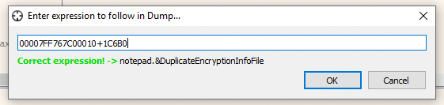

We should now reach the import address table:

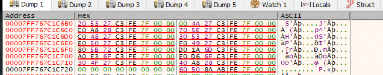

You can also view the complete list, by right clicking in `Dump` workspace and selecting `address`, which would list all the functions in the memory.

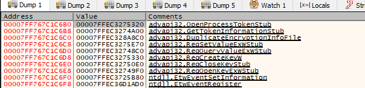

We can also view the same with `Process Hacker` as well. Under `Properties` of `notepad.exe` click on `Memory` and the corresponding address location.

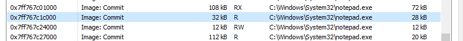

Double clicking on that base location (0x7ff767c1c000) and scroll down to the offset `6B0`.

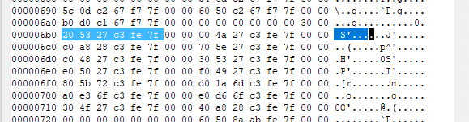

This is our `Import Address Table`.

The last main header is `Section Header`, the definition is:

```c
typedef struct _IMAGE_SECTION_HEADER {
    BYTE    Name[IMAGE_SIZEOF_SHORT_NAME];
    union {
            DWORD   PhysicalAddress;
            DWORD   VirtualSize;
    } Misc;
    DWORD   VirtualAddress;
    DWORD   SizeOfRawData;
    DWORD   PointerToRawData;
    DWORD   PointerToRelocations;
    DWORD   PointerToLinenumbers;
    WORD    NumberOfRelocations;
    WORD    NumberOfLinenumbers;
    DWORD   Characteristics;
} IMAGE_SECTION_HEADER, *PIMAGE_SECTION_HEADER;
```

The PE Bear has revolved this to the following:

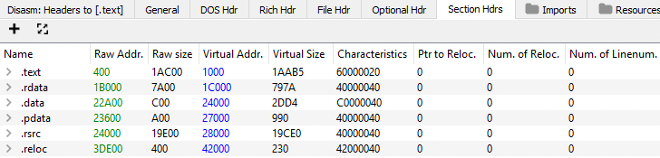

It start with `name`  which is defines by `IMAGE_SIZEOF_SHORT_NAME` which is 8 bytes, for example, the first one is `.text` as shown in the address layout.

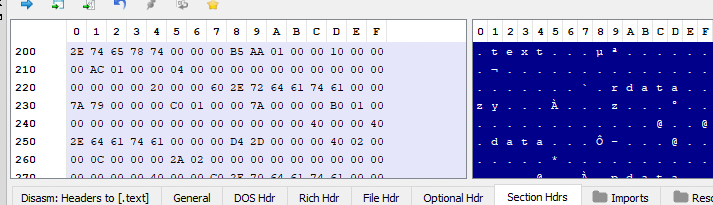

Next is a UNION ( which means this field can be reference this as `VirtualAdress` or as `VirtualSize` ), and it takes only a single  location which is a DWORD and 4 bytes long. This has the value `1AAB5` as resolved by PE Bear. Next the `Virtual Address` is the RVA with value `1000`. The `Raw Size` is 4 byte data has value `1AC00`.  The `Raw Addr`  has the value `400` which is the offset in the file. 

In other words, the `.text` section will be loaded from base address + `1000` ( RVA), and this will be mapped starting from byte number `400` in the file, for size of `1AC00`.  

Another important field is `Characteristics`  with value `60000020` is a combination of several code. Upon referencing the header file:

```c
#define IMAGE_SCN_MEM_EXECUTE                0x20000000  // Section is executable.
#define IMAGE_SCN_MEM_READ                   0x40000000  // Section is readable.
#define IMAGE_SCN_CNT_CODE                   0x00000020  // Section contains code.
```

The same also be verified by using `dumpbin` utility and checking the `flags`
```
dumpbin /headers C:\Windows\System32\notepad.exe
```

Finally PE Bear also has a nice visual representation on how the execuable look in RAW form and in Virtual Memory.

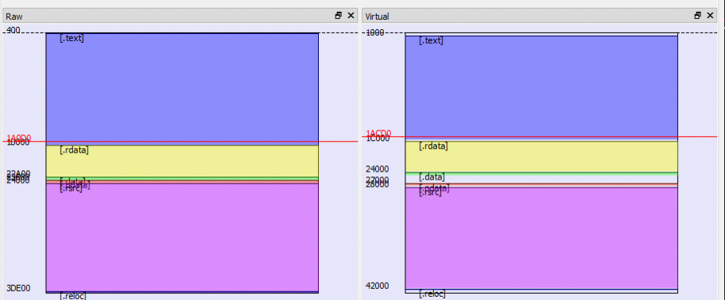


