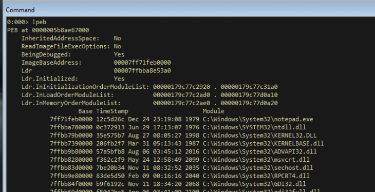
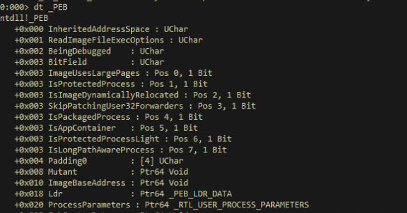
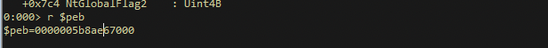
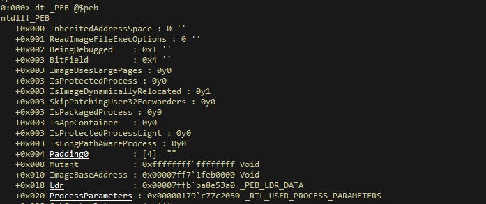
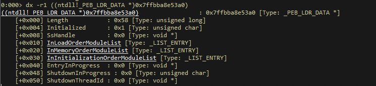
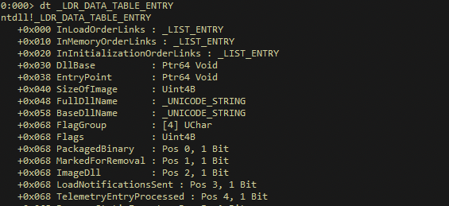
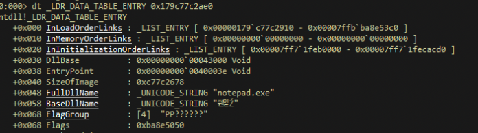
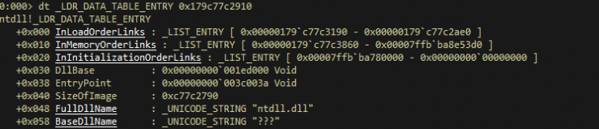
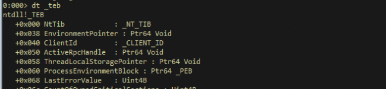

# TEB and PEB

The definition of these structures are defined in the header file `winternl.h` :

```c
typedef struct _PEB {
    BYTE Reserved1[2];
    BYTE BeingDebugged;
    BYTE Reserved2[1];
    PVOID Reserved3[2];
    PPEB_LDR_DATA Ldr;
    PRTL_USER_PROCESS_PARAMETERS ProcessParameters;
    PVOID Reserved4[3];
    PVOID AtlThunkSListPtr;
    PVOID Reserved5;
    ULONG Reserved6;
    PVOID Reserved7;
    ULONG Reserved8;
    ULONG AtlThunkSListPtr32;
    PVOID Reserved9[45];
    BYTE Reserved10[96];
    PPS_POST_PROCESS_INIT_ROUTINE PostProcessInitRoutine;
    BYTE Reserved11[128];
    PVOID Reserved12[1];
    ULONG SessionId;
} PEB, *PPEB;
```

and TEB 

```c
typedef struct _TEB {
    PVOID Reserved1[12];
    PPEB ProcessEnvironmentBlock;
    PVOID Reserved2[399];
    BYTE Reserved3[1952];
    PVOID TlsSlots[64];
    BYTE Reserved4[8];
    PVOID Reserved5[26];
    PVOID ReservedForOle;  // Windows 2000 only
    PVOID Reserved6[4];
    PVOID TlsExpansionSlots;
} TEB, *PTEB;
```

These structures are seemingly very complex to undestand unlike some structures defined in header file `winnt.h`. To understand how these are processed, lets open an executeable `notepad.exe` in WinDBG.exe debugger.

View the `Command` window and input the command `!peb`.



This command returns all the information parsed, including the DLL which are loaded, information on heap, the current directory of the process, environment variable, etc. To list the definition of the structure, use the command `dt _PEB`.



Now, this would offer us more information about the fields in the PEB. Some important fields to note are below:

```
InheritedAddressSpace
BitField
ImageBaseAddress
Ldr
```

To identify the location of the current PEB structure, use the command `r $peb`.



Now with this information, we can map the structure definition which we saw earlier to the current PEB. The command used is `dt _PEB @$peb`



We are interested in PEB, because PEB contains the base address of the DLLs which are interested in. If we lick on `LDR` from the above list we have 3 more fields displayed:



We are interested in `InMemoryOrderModuleList` and upon clicking on it, a double linked list is displayed `Flink` ( forward link) and `Blink` (backward link).

Thre records pointed by each of the links are table entries, which is based on the definition below:
```c
typedef struct _LDR_DATA_TABLE_ENTRY {
    PVOID Reserved1[2];
    LIST_ENTRY InMemoryOrderLinks;
    PVOID Reserved2[2];
    PVOID DllBase;
    PVOID Reserved3[2];
    UNICODE_STRING FullDllName;
    BYTE Reserved4[8];
    PVOID Reserved5[3];
#pragma warning(push)
#pragma warning(disable: 4201) // we'll always use the Microsoft compiler
    union {
        ULONG CheckSum;
        PVOID Reserved6;
    } DUMMYUNIONNAME;
#pragma warning(pop)
    ULONG TimeDateStamp;
} LDR_DATA_TABLE_ENTRY, *PLDR_DATA_TABLE_ENTRY;
```

This is much easier if we view the same on WinDGB using the command `dt _LDR_DATA_TABLE_ENTRY`



So we can view the values in the location from one of entries in `blink` with command `dt _LDR_DATA_TABLE_ENTRY 0x179c77c2ae0`.



When we click on the next `flink` the address `0x179c77c2910`, the next DLL information was displayed:



If we follow in the fashion each `flink` then we can get the next DLL module which is loaded.

Now, the question is how to get to this structure; this is possible with TEB (Threat Environment Block). To view the TEB use the command `dt _teb`



TEB has an interesing enty called `ProcessEnvironmentBlock` which holds the pointed to PEB. Since we are dealing with x64 bit architecture, the offset is 60, if its 32 bit architecture then offset is 30.

One another important point to note is that the strings use UNICODE encoding.

The following table summarises the command used in the module

| `!peb` | List process environment block of the current process |
| `!teb` | List threat environment block of the current process |
| `dt _PEB` | Describes the structure and definition of PEB |
| `dt _TEB` | Describes the structure and definition of TEB |
|`dt _PEB @$peb` | Map the PEB structure with the current values of PEB |
|`dt _LDR_DATA_TABLE_ENTRY`| View the definitions of LDR Table Entry |
|`dt _LDR_DATA_TABLE_ENTRY 0x179c77c2ae0`| View the values in the address location |

